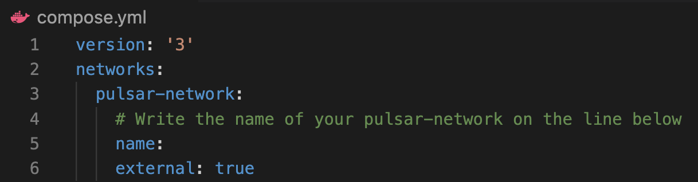

<p align="center">

</p>

# PulsarPortrait
https://pulsarportrait.io/

<!-- **Table of Contents**

- [About](#about)
- [Getting Started](#getting-started)
- [Contributions](#contributions)
- [Authors](#authors) -->

## About

<div align="center" width="100%">


</div>

PulsarPortrait is an open-source application that illustrates the current health of your Pulsar cluster. By scraping data from Prometheus metrics, the app can display a variety of graphs, gauges, and counters. From message data to jetty response times, users can choose from eleven visualizations and frame them in any of the six display slots.

<!--  -->
<p align="center">

</p>

<br>

## Getting Started

### Option 1 - Add PulsarPortrait to your compose.yml file

Simply copy and paste the following code into the services dictionary of your compose.yml file. Please note that if your network is not pulsar, you will need to change it in the networks section of each service.

```yml
prometheus:
  image: pulsarportrait/prometheus:latest
  container_name: prometheus
  networks:
    - pulsar
  ports:
    - '9090:9090'

pulsarportrait:
  image: pulsarportrait/app:latest
  container_name: pulsarportrait
  networks:
    - pulsar
  ports:
    - '3333:3333'

grafana:
  image: pulsarportrait/grafana:latest
  container_name: grafana
  networks:
    - pulsar
  ports:
    - '2222:3000'
  depends_on:
    - prometheus
```

### Option 2 - Use this repo

if you already have a project with Pulsar and do not wish to edit the compose.yml file, you can follow these steps:

- Fork and clone this repo
- Start your Pulsar culster
- In this repo, add your Pulsar cluster's network to the compose.yml file, if you are unsure of the name of your network, you can run docker network ls



- Lastly, run docker compose up -d, and PulsarPortrait will be available on http://localhost:3333/

<br>

## Contributions
We welcome feedback and contributions to this project. If you want to add a feature or fix a bug, please follow these steps:
- Fork and clone this repo
- Create your feature branch by running
```zsh
git checkout -b your-feature-branch-name
```
- Add, commit, and push your changes up to GitHub
- Lastly, make a pull request detailing your changes

<br>

## Authors

- Grant Thomas [GitHub](https://github.com/GrantCT) | [LinkedIn](https://www.linkedin.com/in/grantcthomas/)
- Cyrux Lam [GitHub](https://github.com/cyduckk) | [LinkedIn](https://www.linkedin.com/in/cyrux-lam/)
- Anthony Le [GitHub](https://github.com/anthonyle910) | [LinkedIn](https://www.linkedin.com/in/anthony-le-616b4b101/)
- Jordan Zolman [Github](https://github.com/PrincePuggo) | [LinkedIn](https://www.linkedin.com/in/jordanzolman)